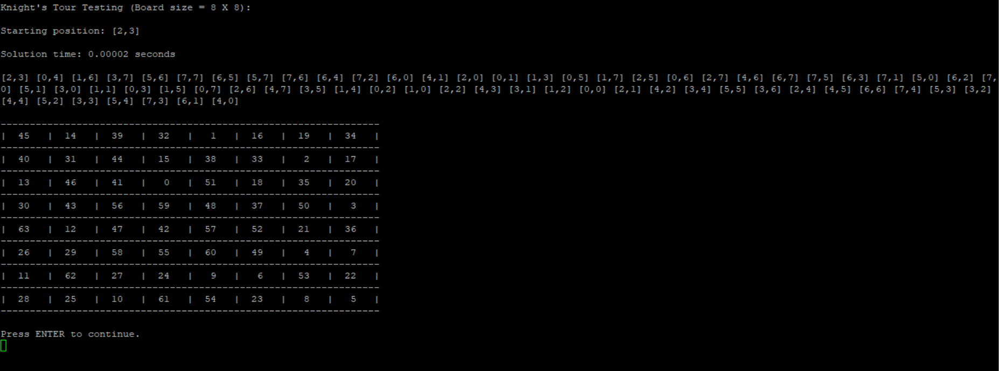
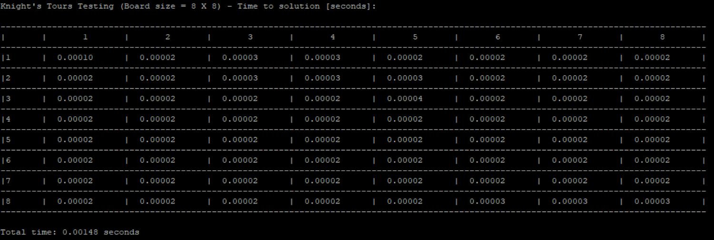

# C Knight's Tour
**A solution to the famous Knight's tour problem.**

There is a knight in a random square on a chessboard.
The knight should cover the entire board in 63 steps - It should step on each square exactly once.
Could you find the right path?

The KnightsTours function gets the knight starting position, and returns a suitable square of steps, in **~0.00002** seconds!

  

### License
:copyright: Hana Oliver

:email: [Contact me](mailto:hana.benami@gmail.com)
